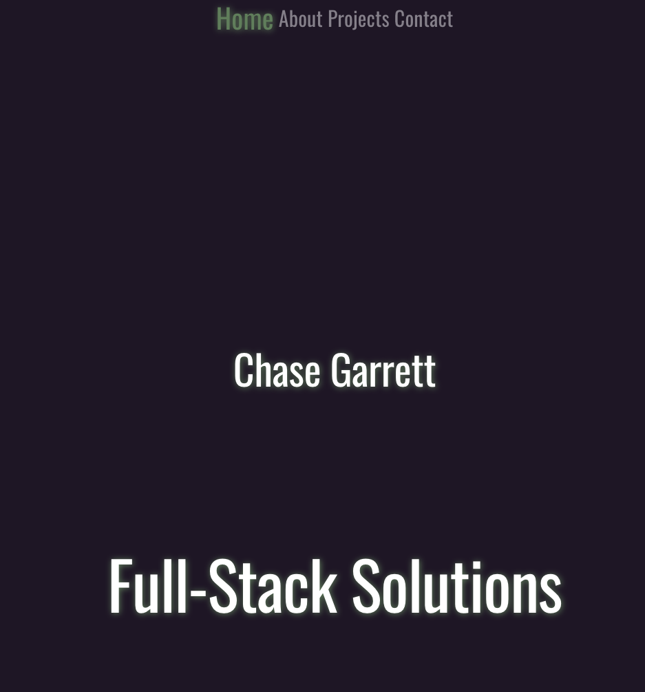

# Portfolio

## Description

Personal portfolio site.

## Table of Contents

-[Installation](#installation)

-[Usage](#usage)

-[Credits](#credits)

-[Tests](#tests)

-[License](#license)

-[Questions](#questions)

## Installation

N/A

## Usage

The portfolio site can be found here: https://cgarrett.netlify.app/

The top of the site has a navigation bar that takes you to different sections of the site.

On the projects page clicking on a project card takes you to the github repo. On the contacts page clicking on one of the contact options either takes you to the site or opens a new email draft.

## Credits

This site uses netlify for hosting and React for the frontend design.

## Tests

N/A

## License

This project is licensed under the MIT license.

## Questions

If you have any questions, please contact me at chasegarrett@tutanota.com. You can also visit my [GitHub](https://github.com/Chase-Garrett) for more of my work.
